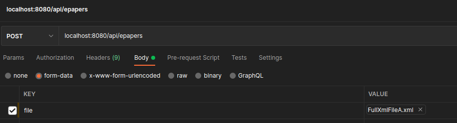
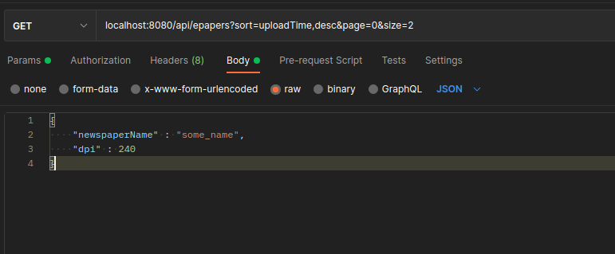

[](https://circleci.com/gh/ppszczepaniak/xmlApi/tree/master)

# xmlApi

Simple API that allows to uploading .xml files, validating them against
included [XSD schema](https://github.com/ppszczepaniak/xmlApi/blob/master/src/main/resources/xsdSchema/schema.xsd),
persisting parsed data into SQL database and easy retrieving for frontend purposes. <br>
Databases used: attached dockerized PostgreSQL and in-memory H2 (for testing purposes).


--------------

## How to run

Application can be run via this command (assuming that [docker compose](https://docs.docker.com/compose/install/)) is
installed in the system:<br>

```
mvn clean package -DskipTests && docker-compose build && docker-compose up
 ```

Starts on: `localhost:8080`<br>
Clean shut-down via:
`docker-compose down -v
`

If only *docker* is installed, one can run the application via, for example:

```
docker run --name postgres-docker -p 5432:5432 -e POSTGRES_PASSWORD=postgres -itd postgres:latest && mvn clean install -DskipTests && mvn spring-boot:run 
```

--------------

## Available Endpoints

* `POST /api/epapers`<br>requires valid xml Multipart file attached in request body parameter `file`. Successful request
  returns 201 and entity ID. Unsuccessful requests return JSON responses, with informative error messages if no, empty
  or invalid file is uploaded. <br>

  Sample Postman settings:<br>
  


* `GET /api/epapers`<br> retrieves persisted Epaper entities. Endpoint allows paging, sorting and filtering.
  Unsuccessful requests return JSON responses, with informative error messages. Accepted parameters:
  * `page` & `size` for paging;
  * `sort`, which expects `key,value` pair where:
    * **key** = entity property (see json below), e.g. `id`or`newspaperName`,
    * **value** = sort direction (`asc` or `desc`).

  Filtering is performed via full or partial json example, which can be attached in request body:
  ```
  {
  "id": int,
  "newspaperName": string,
  "width": int,
  "height": int,
  "dpi": int,
  "uploadTime": "YYYY-MM-DD HH:MM:SS",
  "fileName": "fileName.xml"
  }
  ```
  Sample Postman settings:<br>
  
  

--------------
## Allowed xml format

xmlApi allows uploading xml files of this format:

```<?xml version="1.0" encoding="utf-8"?>
<epaperRequest>
  <deviceInfo name="Browser" id="email@mail">
    <screenInfo width="1092" height="567" dpi="240"/>
    <osInfo name="Browser" version="3.1"/>
    <appInfo>
      <newspaperName>ABC</newspaperName>
      <version>3.0</version>
    </appInfo>
  </deviceInfo>
  <getPages editionDefId="12" publicationDate="2021-06-06"/>
</epaperRequest>
```

Example valid files can be found
in [src/test/resources](https://github.com/ppszczepaniak/xmlApi/tree/master/src/test/resources).
